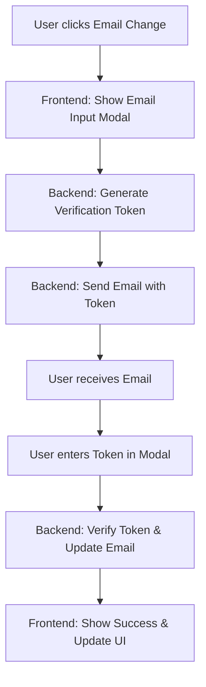
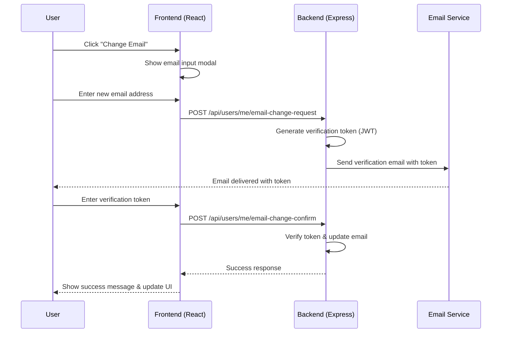

# Design Document: Email Change Improvement

## Overview

This feature enhances the email change functionality in the social media application by implementing a proper email change flow with verification. The current implementation has a stub `sendmail()` function that only shows an alert, and the email change buttons have inconsistent styling. The improvement includes: 1) Updated CSS for email change buttons to match the overall application style, 2) Proper navigation from the profile header to the edit tab, 3) Implementation of email sending with verification tokens, and 4) Clear user guidance on token insertion.

## Architecture

The email change system follows a secure verification flow where users request an email change, receive a verification token via email, and then confirm the change with the token. This prevents unauthorized email changes and ensures email ownership verification.



## Sequence Diagrams

### Main Email Change Flow



## Components and Interfaces

### Component 1: EmailChangeModal

**Purpose**: Modal dialog for email change workflow including email input and token verification.

**Interface**:
```typescript
interface EmailChangeModalProps {
  isOpen: boolean;
  onClose: () => void;
  currentEmail: string;
  onSuccess: (newEmail: string) => void;
}

interface EmailChangeState {
  step: 'input' | 'verify';
  newEmail: string;
  token: string;
  loading: boolean;
  error: string | null;
  tokenSent: boolean;
}
```

**Responsibilities**:
- Collect new email address from user
- Handle email change request to backend
- Display token input field after email sent
- Handle token verification
- Show loading states and error messages

### Component 2: Enhanced ProfilePage

**Purpose**: Updated profile page with improved email change buttons and navigation.

**Interface**:
```typescript
interface ProfilePageEnhancements {
  // Enhanced email change button in header
  headerEmailButton: {
    onClick: () => void;
    style: CSSProperties;
    label: string;
  };
  
  // Enhanced email change button in edit form
  editFormEmailButton: {
    onClick: () => void;
    style: CSSProperties;
    label: string;
  };
  
  // Navigation to edit tab
  navigateToEditTab: () => void;
}
```

**Responsibilities**:
- Provide consistent styling for email change buttons
- Handle navigation from header to edit tab
- Integrate EmailChangeModal component
- Update user email in UI after successful change

## Data Models

### Model 1: EmailChangeRequest

```typescript
interface EmailChangeRequest {
  new_email: string;
  user_id: number;
  token: string; // JWT token for verification
  expires_at: Date; // Token expiration (24 hours)
  created_at: Date;
}

interface EmailChangeRequestDTO {
  new_email: string;
}
```

**Validation Rules**:
- `new_email` must be valid email format
- `new_email` must not be same as current email
- `new_email` must not be already registered by another user

### Model 2: EmailChangeConfirmation

```typescript
interface EmailChangeConfirmation {
  token: string;
  new_email: string;
}

interface EmailChangeResponse {
  success: boolean;
  message: string;
  new_email?: string;
}
```

**Validation Rules**:
- Token must be valid and not expired
- Token must match the requested email change
- User must be authenticated

## Algorithmic Pseudocode

### Main Email Change Algorithm

```typescript
ALGORITHM processEmailChangeWorkflow(user, currentEmail)
INPUT: user (authenticated user object), currentEmail (string)
OUTPUT: success (boolean), newEmail (string), error (string)

BEGIN
  ASSERT user.isAuthenticated() = true
  
  // Step 1: Show modal and collect new email
  newEmail ← showEmailInputModal(currentEmail)
  IF newEmail = null OR newEmail = currentEmail THEN
    RETURN { success: false, error: "No email change requested" }
  END IF
  
  // Step 2: Validate email format
  IF NOT isValidEmail(newEmail) THEN
    RETURN { success: false, error: "Invalid email format" }
  END IF
  
  // Step 3: Request email change with backend
  tokenRequest ← await api.requestEmailChange(newEmail)
  IF tokenRequest.error THEN
    RETURN { success: false, error: tokenRequest.error }
  END IF
  
  // Step 4: Show token input and verify
  token ← showTokenInputModal()
  IF token = null OR token.length < 6 THEN
    RETURN { success: false, error: "Token required" }
  END IF
  
  // Step 5: Confirm email change with token
  confirmation ← await api.confirmEmailChange(token, newEmail)
  IF confirmation.error THEN
    RETURN { success: false, error: confirmation.error }
  END IF
  
  // Step 6: Update UI and return success
  updateUserEmailInUI(newEmail)
  RETURN { success: true, newEmail: newEmail, error: null }
END
```

**Preconditions**:
- User is authenticated and logged in
- Current email is valid and accessible
- API endpoints are available and responsive

**Postconditions**:
- If successful: user email is updated in database and UI
- If failed: error message is displayed to user
- No side effects on other user data

**Loop Invariants**: N/A (no loops in main workflow)

### Token Generation Algorithm

```typescript
ALGORITHM generateEmailChangeToken(userId, newEmail)
INPUT: userId (number), newEmail (string)
OUTPUT: token (string), expiresAt (Date)

BEGIN
  // Generate JWT token with email change claim
  payload ← {
    sub: userId,
    type: "email_change",
    new_email: newEmail,
    iat: Date.now(),
    exp: Date.now() + 24 * 60 * 60 * 1000 // 24 hours
  }
  
  token ← jwt.sign(payload, process.env.JWT_SECRET)
  expiresAt ← new Date(payload.exp)
  
  // Store token in database for verification
  await db.storeEmailChangeToken(userId, newEmail, token, expiresAt)
  
  RETURN { token, expiresAt }
END
```

**Preconditions**:
- userId is valid and exists in database
- newEmail is valid email format
- JWT_SECRET environment variable is set

**Postconditions**:
- Returns valid JWT token with email change claim
- Token is stored in database for verification
- Token expires in 24 hours

## Key Functions with Formal Specifications

### Function 1: requestEmailChange()

```typescript
async function requestEmailChange(newEmail: string): Promise<EmailChangeResponse>
```

**Preconditions**:
- User is authenticated (valid JWT token in headers)
- `newEmail` is non-empty string
- `newEmail` is different from current user email
- `newEmail` passes email format validation

**Postconditions**:
- Returns `{ success: true, message: "Verification email sent" }` if successful
- Returns `{ success: false, message: errorMessage }` if failed
- Generates and stores verification token in database
- Sends verification email to new email address
- No changes to user email until token verification

**Loop Invariants**: N/A

### Function 2: confirmEmailChange()

```typescript
async function confirmEmailChange(token: string, newEmail: string): Promise<EmailChangeResponse>
```

**Preconditions**:
- User is authenticated (valid JWT token in headers)
- `token` is non-empty string (6+ characters)
- `newEmail` matches the email in token payload
- Token has not expired (within 24 hours)

**Postconditions**:
- Returns `{ success: true, new_email: newEmail }` if token valid
- Returns `{ success: false, message: "Invalid or expired token" }` if token invalid
- Updates user email in database if successful
- Invalidates used token to prevent reuse
- Sends confirmation email to old and new email addresses

### Function 3: updateButtonStyles()

```typescript
function updateButtonStyles(): CSSProperties
```

**Preconditions**:
- Application CSS variables are defined (:root styles)
- Existing button styles are available for reference
- Design system consistency is maintained

**Postconditions**:
- Returns CSS properties matching application design system
- Buttons have consistent hover/focus states
- Buttons are accessible (proper contrast, sizing)
- Styles integrate with existing component structure

## Example Usage

```typescript
// Example 1: Enhanced ProfilePage component with new email change flow
const ProfilePage: React.FC = () => {
  const { user } = useAuth();
  const [showEmailModal, setShowEmailModal] = useState(false);
  
  // Header email button - navigates to edit tab
  const handleHeaderEmailClick = () => {
    // Set active tab to 'edit'
    setTab('edit');
    // Scroll to email field
    setTimeout(() => {
      document.querySelector('.edit-email-row')?.scrollIntoView({ behavior: 'smooth' });
      // Show email change modal after navigation
      setShowEmailModal(true);
    }, 100);
  };
  
  // Edit form email button - shows modal directly
  const handleEditFormEmailClick = () => {
    setShowEmailModal(true);
  };
  
  return (
    <div className="profile-wrap">
      {/* Profile header with enhanced email button */}
      <div className="profile-header">
        <div className="profile-info">
          <div className="profile-email-row">
            <p className="profile-email">{user.email}</p>
            <button 
              className="btn-email-change"
              onClick={handleHeaderEmailClick}
              title="Change email address"
            >
              ✉ Change Email
            </button>
          </div>
        </div>
      </div>
      
      {/* Edit form with enhanced email button */}
      {tab === 'edit' && (
        <form className="profile-edit-form">
          <div className="edit-email-row">
            <label>
              Email
              <input 
                value={user.email} 
                disabled 
                className="auth-input edit-email-disabled" 
                placeholder="current-email@example.com"
              />
            </label>
            <button 
              type="button" 
              className="btn-email-change"
              onClick={handleEditFormEmailClick}
            >
              Change Email
            </button>
          </div>
        </form>
      )}
      
      {/* Email change modal */}
      <EmailChangeModal
        isOpen={showEmailModal}
        onClose={() => setShowEmailModal(false)}
        currentEmail={user.email}
        onSuccess={(newEmail) => {
          // Update user context and UI
          updateUser({ ...user, email: newEmail });
          toast('Email updated successfully ✓');
        }}
      />
    </div>
  );
};

// Example 2: Backend email change endpoint implementation
app.post('/api/users/me/email-change-request', authMiddleware, async (req, res) => {
  const { new_email } = req.body;
  const userId = req.user.id;
  
  // Validation
  if (!isValidEmail(new_email)) {
    return res.status(400).json({ error: 'Invalid email format' });
  }
  
  if (new_email === req.user.email) {
    return res.status(400).json({ error: 'New email must be different from current email' });
  }
  
  // Check if email already exists
  const existingUser = await pool.query(
    'SELECT id FROM users WHERE email = $1', [new_email]
  );
  if (existingUser.rows.length > 0) {
    return res.status(409).json({ error: 'Email already registered' });
  }
  
  // Generate verification token
  const token = jwt.sign(
    { 
      user_id: userId, 
      new_email: new_email,
      type: 'email_change'
    },
    process.env.JWT_SECRET,
    { expiresIn: '24h' }
  );
  
  // Store token in database
  await pool.query(
    `INSERT INTO email_change_tokens (user_id, new_email, token, expires_at) 
     VALUES ($1, $2, $3, NOW() + INTERVAL '24 hours')`,
    [userId, new_email, token]
  );
  
  // Send verification email (in production, use real email service)
  const verificationLink = `${process.env.FRONTEND_URL}/verify-email?token=${token}`;
  console.log(`[DEV] Email change token for ${new_email}: ${token}`);
  console.log(`[DEV] Verification link: ${verificationLink}`);
  
  res.json({ 
    success: true, 
    message: 'Verification email sent',
    // In development, return token for testing
    token: process.env.NODE_ENV === 'development' ? token : undefined
  });
});

// Example 3: CSS for enhanced email change buttons
const enhancedButtonStyles = `
.btn-email-change {
  padding: 8px 16px;
  font-size: 14px;
  font-weight: 600;
  border: 1px solid var(--border);
  border-radius: var(--radius-sm);
  background: var(--bg-card);
  color: var(--text);
  cursor: pointer;
  transition: all 0.2s ease;
  display: inline-flex;
  align-items: center;
  gap: 6px;
}

.btn-email-change:hover {
  background: var(--bg-hover);
  border-color: var(--accent);
  color: var(--accent);
}

.btn-email-change:focus {
  outline: 2px solid var(--accent);
  outline-offset: 2px;
}

.btn-email-change:active {
  transform: translateY(1px);
}

/* Specific styles for header button */
.profile-email-row .btn-email-change {
  padding: 4px 12px;
  font-size: 13px;
}

/* Specific styles for edit form button */
.edit-email-row .btn-email-change {
  align-self: flex-end;
  height: 42px; /* Match input height */
  white-space: nowrap;
}
`;
```

## Correctness Properties

### Property 1: Email Uniqueness
**For all users U1, U2 in the system, if U1 ≠ U2 then U1.email ≠ U2.email**
- Ensures email addresses remain unique across all users
- Prevents account confusion and security issues
- Verified during email change request

### Property 2: Token Validity Window  
**For all email change tokens T, T.expires_at - T.created_at = 24 hours ± 5 minutes**
- Tokens are valid for exactly 24 hours
- Prevents indefinite access to email change functionality
- Automatic cleanup of expired tokens

### Property 3: Button Style Consistency
**For all email change buttons B in the application, B.style matches application design system**
- Consistent visual appearance across all instances
- Proper accessibility attributes (contrast, sizing)
- Unified interaction states (hover, focus, active)

### Property 4: Navigation Correctness
**When user clicks header email change button, active tab = 'edit' AND email field is visible**
- Ensures proper navigation to edit interface
- User can immediately see and interact with email field
- Smooth scrolling to relevant section

## Error Handling

### Error Scenario 1: Invalid Email Format
**Condition**: User enters malformed email address (missing @, invalid domain)
**Response**: Show validation error "Please enter a valid email address"
**Recovery**: Keep modal open with error message, highlight invalid field

### Error Scenario 2: Email Already Registered
**Condition**: Requested email is already used by another user
**Response**: Show error "This email is already registered. Please use a different email."
**Recovery**: Clear email input, allow user to enter different email

### Error Scenario 3: Token Expired
**Condition**: User tries to verify with expired token (>24 hours old)
**Response**: Show error "Verification link has expired. Please request a new email."
**Recovery**: Option to resend verification email to same address

### Error Scenario 4: Network Failure
**Condition**: API request fails due to network issues
**Response**: Show error "Network error. Please check your connection and try again."
**Recovery**: Retry button with exponential backoff

## Testing Strategy

### Unit Testing Approach
- Test email validation regex with various valid/invalid emails
- Test token generation and verification logic
- Test button styling consistency across components
- Test navigation from header to edit tab
- Mock API responses for success/failure scenarios

**Test Coverage Goals**: 90% coverage for email change related components and utilities

### Property-Based Testing Approach
- Generate random email addresses to test validation
- Test token expiration logic with various time offsets
- Verify style consistency across randomly generated UI states
- Test navigation correctness with different user states

**Property Test Library**: Jest with fast-check for property-based testing

### Integration Testing Approach
- End-to-end test of complete email change flow
- Test email sending integration (mock email service)
- Test database operations for token storage and user updates
- Test UI updates after successful email change

## Performance Considerations

- **Token Generation**: JWT signing is O(1) and fast
- **Email Sending**: Async operation with queueing for production scale
- **Database Queries**: Index on email_change_tokens(user_id, expires_at) for fast lookups
- **UI Updates**: Optimistic updates for better perceived performance
- **Bundle Size**: Modal component lazy-loaded to reduce initial bundle

## Security Considerations

- **Token Security**: JWT tokens signed with strong secret, 24-hour expiration
- **Email Verification**: Required to prove ownership of new email
- **Rate Limiting**: Limit email change requests to 3 per hour per user
- **Input Validation**: Sanitize all email inputs to prevent injection
- **CSRF Protection**: Tokens included in authenticated requests only
- **Logging**: Audit trail of all email change attempts (success/failure)

## Dependencies

### Frontend Dependencies
- React 18+ (already in use)
- Axios for API calls (already in use)
- CSS Modules for styling (already in use)
- No additional major dependencies required

### Backend Dependencies
- jsonwebtoken for token generation (already in use)
- Nodemailer or SendGrid for email sending (new - for production)
- Database: PostgreSQL with email_change_tokens table (new table)

### Development Dependencies
- Jest for testing (already in use)
- fast-check for property-based testing (new)
- React Testing Library for component tests (already in use)